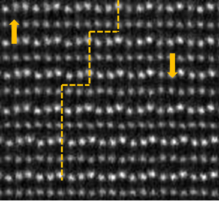
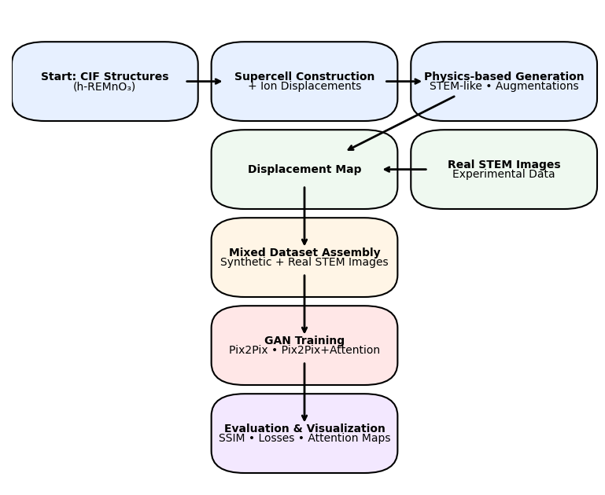

# Domain Wall Image Generation and GAN Training

The challenges of applying machine learning models to electron microscopy images lie in two fundamental limitations:  

1. **Access to representative images**:      
To train  a dataset with machine learning, one requires a large number of images, although it depends on the problem and the complexity of the images. Capturing lattices that reveal specific features — such as zone axes or atomic arrangements — often requires computational methods to build unit cells. This involves generating unit cells, constructing supercells, and performing image simulations. Each step can be computationally demanding, although GPU/CPU-powered workstations make the workflow more practical. 

2. **Class imbalance in datasets**:    
In sub-Ångström microscopy like STEM (Scanning Transmission Electron Microscopy), it is common to have many images of some features but very few of others in a class of materials. The time and cost of sample preparation and instrument use often prevent the collection of balanced datasets. Even with large numbers of images, certain rare structural features may be underrepresented.  

This project showcases a solution to these challenges in the context of **deep learning for atomic-resolution microscopy**. As a testbed, we focus on **hexagonal rare-earth manganites**, which exhibit complex domain walls and require imaging at resolutions below 0.1 nm on probe-corrected STEM machines. Hexagonal rare-earth manganites (h-REMnO₃, RE: Y, Dy, Er, Tm, Lu, Sc) are a go-to platform for studying topological ferroelectric textures—neutral/charged walls, interlocked walls, and vortex–antivortex networks that emerge via Kibble–Zurek–type symmetry breaking at the trimerization/ferroelectric transition. Aberation-corrected microcopy has been a promising method of imaging atomically sharp ferroelectric walls and their switching.

## 🖼️ Example STEM Image of Domain Wall

Here is an experimental atomic-resolution STEM image of a domain wall in h-REMnO₃, which the synthetic and GAN-generated data aim to mimic:

<p align="center">
  
</p>
---

## 🎯 Project Goals

This repository provides a **two-stage pipeline**:

1. **Physics-based image generation**  
   Synthetic STEM-like images of hexagonal REMnO₃ domain walls are generated using crystallographic models, Y-ion displacements, and augmentations. While the functions support multiple wall types (type A, type B, type C, type D), the current focus is on three         configurations:  
   - **UP** (upward polarization)  
   - **DN** (downward polarization)  
   - **typeC-DW** (switching walls, i.e. any UP ↔ DN transition)  

   Image generation leverages **pymatgen** (https://pymatgen.org/) for structure handling (`Structure`, `CifParser`, `CifWriter`, `SpacegroupAnalyzer`) and adds atomic displacements to simulate domain walls. The package enables the direct use of crystallographic CIF files, allowing for subsequent processing to create supercells and/or introduce lattice distortions to highlight materials-dependent features. The STEM image simulation requires supercell creation, and pymatgen does this straightforwardly.    

   **References**:  
   The project also allows different types of domain walls, so-called Type I and Type II walls, as explained in the following references.

   - Lei Tian *et al.*, *Direct observation of interlocked domain walls and topological four-state vortex-like domain patterns in multiferroic YMnO₃*, Appl. Phys. Lett. **106**, 112903 (2015). [doi:10.1063/1.4915259](https://doi.org/10.1063/1.4915259)  
   - Q. Zhang *et al.*, *Direct Observation of Multiferroic Vortex Domains in YMnO₃*, Sci. Rep. **3**, 2741 (2013). [doi:10.1038/srep02741](https://doi.org/10.1038/srep02741)  

2. **GAN training on Mixed Datasets**  
   To bridge the gap between **idealized simulations** and **real atomic-resolution images**, this project implements conditional GANs (Pix2Pix and Pix2Pix augmented with WallAttention). The networks are trained to translate **displacement-field maps** into STEM-like images, capturing both the global lattice symmetry and the local disorder at domain walls. Pix2Pix serves as the robust baseline for paired image-to-image translation, while the WallAttention variant introduces spatial focus on the wall regions—critical for reproducing the sharp, heterogeneous structures of domain walls.

A distinctive feature of this pipeline is the ability to train on hybrid datasets, combining physics-generated images (from crystallographic models with controlled displacements and augmentations) with real STEM acquisitions. This mixed-data strategy supports transfer learning, enabling the model to inherit physical priors from synthetic images while fine-tuning on experimentally acquired data. The result is a generator that not only produces visually realistic STEM-like images but also respects the atomic-scale physics encoded in real measurements.

---

### 🎛 Why FiLM and Attention?

- **FiLM (Feature-wise Linear Modulation):**  
  Applies per-channel scale and shift to intermediate feature maps, injecting domain labels (UP, DN, typeC) directly into the generator.  
  Ideal for **uniform domains (UP/DN) or simple switching**, where the condition is global and consistent across the whole image.  

- **Attention (WallAttention module):**  
  Provides a **pixel-wise spatial mask** that highlights domain wall regions, guiding the generator to focus on structurally complex areas, in this case, atomically sharp walls.  
  Essential for **typeC domain walls**, where heterogeneous UP/DN mixtures require learning *where* the polarity changes, not just *what* the label is.  

👉 Together, **FiLM + Attention** combine global conditioning with spatial selectivity — enabling realistic synthesis of both simple single-axis domains and complex multi-state walls.

## 📊 Project Flow

Below is a schematic of the full pipeline, from CIF input structures to GAN synthesis:

<p align="center">
  
</p>

---

## 📂 Project Structure

The project is organized to separate **physics-based image generation** from **GAN learning**.

```
domain_wall_generation/
├── physics/                         # physics-based STEM image generation
│   ├── core/
│   │   ├── domain_walls.py          # generate_type_c_dw, generate_tail_to_tail_domain_wall, etc.
│   │   ├── y_ions.py                # get_y_ions
│   │   ├── displacement.py          # generate_displacement_map
│   │   └── utils.py                 # render_stem_image, show_stem_image, apply_image_augmentation
│   ├── scripts/
│   │   ├── main.py                  # simple dataset generator
│   │   ├── main_parallel.py         # parallel dataset generation
│   │   ├── single_image_plot.py     # visualize one augmented image
│   │   ├── generate_single_image.py # type B domain wall example
│   │   └── displacement_map.py      # batch displacement map builder
│   └── configs/
│       └── label_maps.py            # label mappings

├── gan/                             # GAN models, training, and evaluation
│   ├── ml_utils/
│   │   ├── dataset.py
│   │   ├── transforms.py
│   │   ├── losses.py
│   │   ├── visualization.py
│   │   └── augmentation.py
│   ├── models/
│   │   ├── discriminator.py
│   │   ├── film.py
│   │   ├── unet_blocks.py
│   │   ├── unified_router.py
│   │   └── base_generators/
│   │       ├── sharp_pix2pix.py
│   │       └── wall_attention_generator.py
│   ├── train/
│   │   ├── train_pix2pix.py
│   │   └── train_router.py
│   ├── eval/
│   │   ├── plotting.py
│   │   └── image_generation.py
│   └── configs/
│       ├── train_defaults.yaml
│       └── labels.yaml

├── scripts/                         # command-line entrypoints
│   ├── build_dataset.py
│   ├── train_gan.py
│   └── generate_with_gan.py

├── notebooks/
│   └── GAN_synthesis_notebook.ipynb

├── data/
│   ├── cif/
│   ├── generated_images/
│   └── generated_disp/

├── outputs/
│   ├── runs/
│   ├── models/
│   └── figures/

├── tests/
│   └── __init__.py

└── README.md
```

---

## 🧠 Key Features

- 🧪 Physics-based domain wall generation with crystallographic displacements  
- 🔁 Augmentations: salt & pepper, drift, atomic plane distortions  
- 🤖 GANs: Pix2Pix and WallAttention variants  
- 📊 Metrics: SSIM, loss component tracking, epoch plots  
- 🖼️ Visualization: stochastic variants, attention overlays  
- ⚡ Reproducibility: includes tests/ and ready-to-run Jupyter notebook for Kaggle (notebooks/GAN_synthesis_notebook.ipynb).
- 🧩 Modular design: physics generation, GAN models, and training separated for easier extension or substitution.
---

## 🚀 Getting Started

### 1. Clone the repository

```bash
git clone https://github.com/yourusername/domain_wall_generation.git
cd domain_wall_generation
```

### 2. Install dependencies

```bash
pip install -r requirements.txt
```
💡 Recommended environment: Python 3.9+, PyTorch >= 1.12, GPU with CUDA support. Tested with NVIDIA RTX GPUs. Make sure pymatgen, kornia, and pytorch-msssim are installed properly for structure handling and loss calculations.

---

## 🧪 Stage 1: Physics-based Dataset Generation

```bash
PYTHONPATH=. python scripts/build_dataset.py   --cif data/ymno3_unpolar.cif   --out outputs/stem_domain   --make-disp
```

- Images → `outputs/stem_domain/`  
- Displacement maps → `outputs/stem_domain_disp/`  

Tip: try scripts/single_image_plot.py first to quickly visualize one augmented example before launching a full dataset build.

---

## 🤖 Stage 2: Train GAN

```bash
PYTHONPATH=. python scripts/train_gan.py   --disp-root outputs/stem_domain_disp   --image-root outputs/stem_domain   --classes '["typeC-DW"]'   --save-dir outputs/gan_runs/typec   --epochs 30
```
Supports FiLM-only (sharp_pix2pix) or FiLM+Attention (wall_attention_generator) via --model flag.

---

## 🎨 Stage 3: Generate with Trained GAN

```bash
PYTHONPATH=. python scripts/generate_with_gan.py   --checkpoint outputs/gan_runs/typec/generator.pth   --model attention   --classes '["typeC-DW"]'   --disp-root outputs/stem_domain_disp   --image-root outputs/stem_domain   --save-dir outputs/gan_infer/typec
```
You can also explore stochastic outputs by varying latent z vectors, visualized in eval/image_generation.py.

---

## 📊 Outputs

- `outputs/stem_domain/` — synthetic STEM images  
- `outputs/stem_domain_disp/` — displacement maps  
- `outputs/gan_runs/` — GAN checkpoints + training logs  
- `outputs/gan_infer/` — GAN-generated images  
- `outputs/figures/` — loss curves, SSIM distributions, attention overlays.

---

## 📜 License

Distributed under the MIT License. See `LICENSE` for details.
If you use this code in academic work, please cite the references in the Physics-based section above.

---

## 🙋 Contact

Questions, feedback, or collaborations?  
Open a GitHub issue or contact: [alibaghizade@gmail.com](mailto:alibaghizade@gmail.com)  
